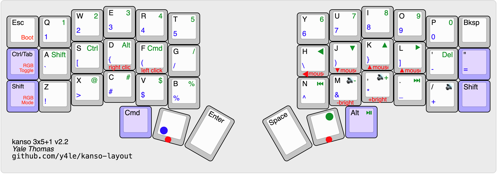

# [Kanso](https://github.com/y4le/kanso)

Kanso is a minimal keyboard layout designed for programming and general usage. It stays close to QWERTY so you don't lose muscle memory, while moving the most painful ergonomic problems off the pinky and onto stronger fingers and thumbs.

### Mirrored brackets on home row

Parentheses, brackets, braces, and angle brackets are mirrored across the home row index fingers; left index is the opening delimiter, right index is the closing one. This keeps the most frequently used programming symbols right on home row instead of everything overloading the right pinky

### Numbers and symbols on the same fingers as QWERTY

Numbers and symbols are both accessible via thumb modifiers while preserving their QWERTY finger assignments. If you know where `5` and `%` are on a standard keyboard, you already know where they are here.

### One-handed nav layer

A right-hand thumb modifier turns the Vim direction keys (hjkl) into arrow keys for one-handed navigation. The left hand in this mode provides all modifier keys (Shift, Alt, Ctrl, Cmd), making text selection and cursor navigation easy — Shift+Arrow to select, Cmd+Arrow to jump to line boundaries, and so on.

## Implementations

- [Cantor](cantor/)
- [Corne](corne/)
- [Let's Split](lets_split/)
- [Planck Light](planck_light/)

